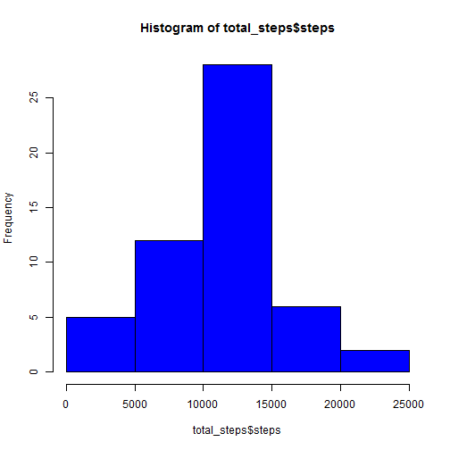
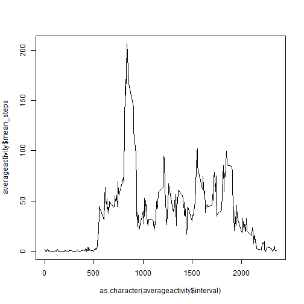
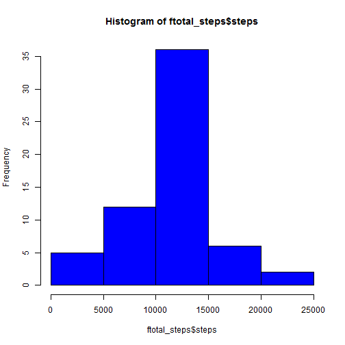

## Loading and preprocessing the data

```r
library(knitr)
data <- read.csv(unz("activity.zip", "activity.csv"),stringsAsFactors = FALSE)
data$date <- as.Date(data$date)
```


## What is mean total number of steps taken per day?

```r
completedata <- data[complete.cases(data$step),]
by1 <- factor(completedata$date)
total_steps <- aggregate(completedata$steps, by=list(by1), sum, simplify = TRUE)
names(total_steps) <- c("date", "steps")
hist(total_steps$steps, col="blue")
```

 

```r
meansteps <- mean(total_steps$steps)
mediansteps <- median(total_steps$steps)
```
The mean total number of steps taken per day is 1.0766189 &times; 10<sup>4</sup>.  
The median total number of steps taken per day is 10765.

## What is the average daily activity pattern?

```r
by2 <- factor(completedata$interval)
averageactivity <- aggregate(completedata$steps, by=list(by2),mean,simplify=TRUE)
names(averageactivity) <- c("interval", "mean_steps")
plot(as.character(averageactivity$interval),averageactivity$mean_steps,type="l")
```

 

```r
maxinterval <- averageactivity$interval[which.max(averageactivity$mean_steps)]
```
On average across all the days in the dataset the interval 835 contains the maximum number of steps.

## Imputing missing values

```r
NAs <- sum(is.na(data$steps))
```
The total number of missing values in the dataset is 2304.  

Strategy for filling the missing data: interval mean across all days:

```r
filled <- data
index <- match(data$interval[is.na(data$steps)], averageactivity$interval)
filled$steps[is.na(data$steps)] <- averageactivity[index,2]
```


```r
by3 <- factor(filled$date)
ftotal_steps <- aggregate(filled$steps, by=list(by3), sum, simplify = TRUE)
names(ftotal_steps) <- c("date", "steps")
hist(ftotal_steps$steps, col="blue")
```

 

```r
fmeansteps <- mean(total_steps$steps)
fmediansteps <- median(total_steps$steps)
```
The mean total number of steps taken per day with filled values is 1.0766189 &times; 10<sup>4</sup>.  
The median total number of steps taken per day filled values is 10765.
There is no change, since we've used means.

## Are there differences in activity patterns between weekdays and weekends?

```r
filled$day_of_week <- weekdays(as.POSIXct(as.character(data$date)))
```
